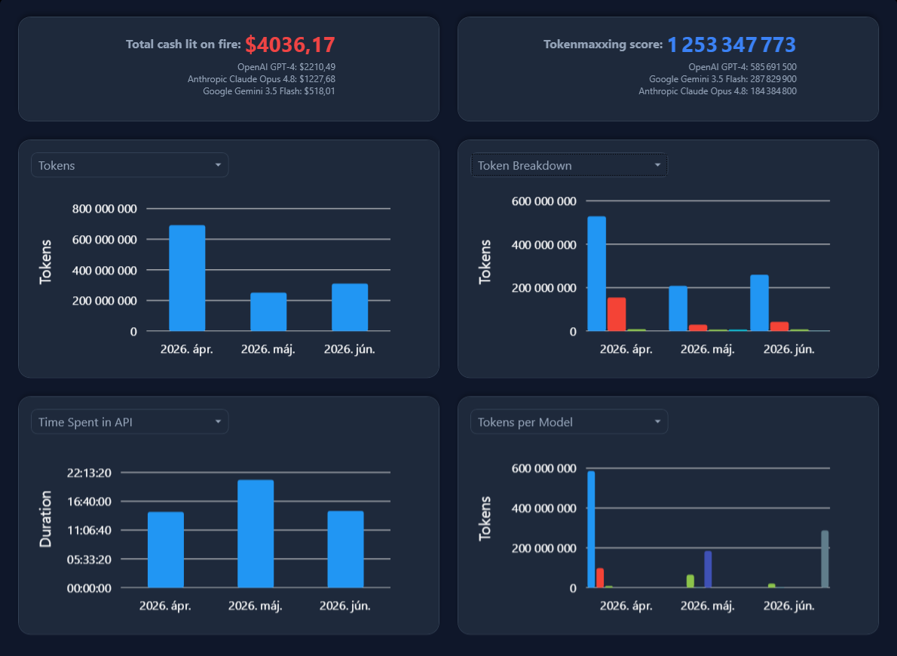

# Disappointment Calculator
Calculate the time and money you spent on AI so it could make knowledge debt in
your projects.

## Features
- Load and parse AI session data from your local machine
  - Supports Google Antigravity, GitHub Copilot, Codex, and Visual Studio Code
- Aggregate token usage per month or day
- Visualize total token consumption over time
- Break down token usage by model type
- Estimate and display cost, even per model
- And many more graph types on a dashboard
- Cross-platform support through MAUI [in this commit](https://github.com/VoidXH/Disappointment-Calculator/commit/50e1caca6ac6a9359c165c0160e5434f2c45c1db)

## Licence
By downloading the software and/or its source code, you are accepting these
terms. The source code, just like the compiled software, is given to you for
free, but without any warranty. It is not guaranteed to work, and the developer
is not responsible for any damages from the use of the software. You are allowed
to make any modifications, and release them for free under this licence. If you
release a modified version, you have to link this repository as its source. You
are not allowed to sell any part of the original or the modified version. You
are also not allowed to show advertisements in the modified software. If you
include these code or any part of the original version in any other project,
these terms still apply.
